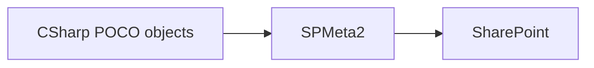

# SubPoint Solutions Docs

This repository contains the content for all SubPoint Solutions projects - SPMeta2, Metapack, and others. All content gets replicated with http://docs.subpointsolutions.com web site and authored under PR based workflow.

##  Build status
| Branch  | Status | URL |
| ------------- | ------------- |  ------------- |
| master|  [](https://ci.appveyor.com/project/SubPointSupport/spmeta2-docs/branch/master) |  http://docs.subpointsolutions.com |
| beta  | [](https://ci.appveyor.com/project/SubPointSupport/spmeta2-docs/branch/beta)  | https://subpointsolutions-docs-beta.netlify.com |
| dev   | [](https://ci.appveyor.com/project/SubPointSupport/spmeta2-docs/branch/dev) | https://subpointsolutions-docs-dev.netlify.com |

## How this works

This project uses [docusaurus](https://docusaurus.io) to transform `markdown` content into a static web site. We tend to use a minimal amount of customisations to keep low complexity and maintainability. 

Source code highlighting is done with [default docusaurus syntax highlighting](https://docusaurus.io/docs/en/doc-markdown#syntax-highlighting). The only custom piece is [mermaidjs](https://mermaidjs.github.io/) integration which enables rendering of diagrams and flowcharts from the text written in markdown.

[netlify](https://www.netlify.com) is used as a hosting platform. It provides a CDN for static web site hosting and enables super-fast, under a second response time.

Build tasks and automation is done with PowerShell6 and [Invoke-Build](https://github.com/nightroman/Invoke-Build) projects. Such approach brings cross-platform compatibility, the project can be developed under Windows, MacOS, and Docker container. 

[AppVeyor](https://www.appveyor.com/) is used as a continuous integration solution. We use PR-baed workflow with three mains branches `dev`, `beta`, and `master`. Every branch gets a dedicated `netlify` web site. Build promotion goes from `dev` to `beta`, and then to `master`.

## Authoring workflow

Project documentation is organised under `/docs` folder. All content is written in `markdown`, can contain images, source code snippets, and mermaid diagrams. Every project lives within corresponding subfolder:
* `docs/metapack`
* `docs/resp`
* `docs/spmeta2`
* `docs/uplift`

Authoring content is a matter of writing or editing existing `markdown` files. We tend to use four types of content:

### Writing/editing content
Just create or edit existing `markdown` files 

### Adding images
Images should be added under `assets/project-name` folder relative to the markdown document where images are referenced in. Such approach ensures that markdown documents with images are rendered correctly under VSCode or other editors as well on the Github web site. 

Image reference can be done via standard markdown tag:

````

````

### Source code snippets
Source code snippet should use triple backticks and, optionally, a language such as `shell`, `cs`, `js`, `xml` or others. Final snippet is rendered using [default docusaurus syntax highlighting](https://docusaurus.io/docs/en/doc-markdown#syntax-highlighting). 

````
```cs
// Step 1, create 'definitions' - a bunch of CSharp POCO objects 
var clientDescriptionField = new FieldDefinition
{
    Title = "Client Description",
    InternalName = "dcs_ClientDescription",
    Group = DocConsts.DefaulFieldsGroup,
    Id = new Guid("06975b67-01f5-47d7-9e2e-2702dfb8c217"),
    FieldType = BuiltInFieldTypes.Note,
};
```
````

### Mermad diagrams
[mermaidjs](https://mermaidjs.github.io/) is a great library to render diagrams and flowcharts from text. It is smoothly  integrated into the authoring workflow. Use triple backticks with `mermaid` as a language.

Additionally, [mermaid live editor](https://mermaidjs.github.io/mermaid-live-editor) can be used to preview diagrams before putting them into documentation. 

````

````

### Landing page 
Landing page is React-based component under `website\pages\en\index.js`. This is a built-in docusaurus capability, so refer to [docusaurus docs](https://docusaurus.io/docs) for additional help.

### Second navigation / sidebars
Second navigation is a simple JavaScript array under `website\sidebars.json`. This is a built-in docusaurus capability, so refer to [docusaurus docs](https://docusaurus.io/docs) for additional help.

### Styling
Minimal changes to styling were done under `website\static\css`. This is a built-in docusaurus capability, so refer to [docusaurus docs](https://docusaurus.io/docs) for additional help.

## Local development workflow
Local development comes handy to author the content in a real-time. Docusaurus provides live reload feature which refreshed the browser as the content gets changed. 

To get started, get the latest `dev` branch or fork the repo on the GitHub:
```shell
# get the source code
git clone https://github.com/SubPointSolutions/subpointsolutions-docs.git
cd subpointsolutions-docs

# checkout the dev branch
git checkout dev

# make sure 
git status

# optionally, pull the latest
git pull
```

Local development experience consists of [Invoke-Build](https://github.com/nightroman/Invoke-Build) tasks. Two main files are `.build.ps1` and `.build-helpers.ps1`. Use the following tasks to get started and refer to `Invoke-Build` documentation for additional help.

Temporary build folders are `build-docs` and `build-artifacts`. They contain build artefacts such as zip package for the final web site or web site content ready to be published.

```powershell
# show available tasks
invoke-build ?

# start docusaurus web site preview on port 3000
invoke-build Start

# invoke default build
invoke-build 
invoke-build DefaultBuild

# serving local web site from build-docs folder
invoke-build Serve

# deploy/publish to netlify
invoke-build NetlifyRedeploy
invoke-build NetlifyRepublish
```

It is possible to produce an offline version of the whole web site documentation. Refer to the following flow:
```powershell
# build web site
# - build-docs folder contains all web site pages
# - build-artifacts folder contains zip archive of all web site pages
invoke-build DefaultBuild, CreateZipArchive
```

Once done, the web site content can be served locally with any HTTP server. For example, NodeJS [http-server](https://www.npmjs.com/package/http-server), any [other local web-server](https://gist.github.com/willurd/5720255), docker based NGINX, Apache, IIS and so on.

This project has a few QA relates task to ensure that generated web site has all the pages and does not have broken links. This is an advanced topic and not normally used for content authoring activities. Refer to the following automation tasks and their implementations:

```powershell
# validate sitemap and broken links
invoke-build ValidateSiteMap
invoke-build ValidateBrokenLinks
```

## Feature requests, support and contributions
All contributions are welcome. If you have an idea, create [a new GitHub issue](https://github.com/SubPointSolutions/subpointsolutions-docs/issues). Feel free to edit existing content and make a PR for this as well.