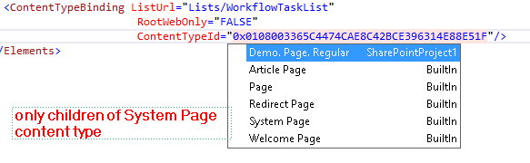

---
Title: ContentTypeId attribute
FileName: ContentTypeBindingContentTypeId.html
---

###  Description
ContentTypeBinding definition has ContentTypeId attribute. It should contain Id of content type.
reSP allows you to select value from the drop-down list.
Just use Ctrl+Space shortcut.
 

