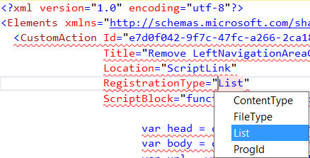

---
Title: RegistrationType attribute
FileName: CustomActionRegistrationType.html
---

### Description
CustomAction definition has RegistrationType attribute. It should contain one of the predefined string constant.
reSP allows you to select value from the drop-down list.
Just use Ctrl+Space shortcut.
 

  
### Links
- [CustomAction Element](https://msdn.microsoft.com/en-us/library/office/ms460194.aspx)
- [RegistrationType & RegistrationId in SharePoint 2010 declarative Ribbon customizations](http://blog.alexboev.com/2011/12/registrationtype-registrationid-in.html)

