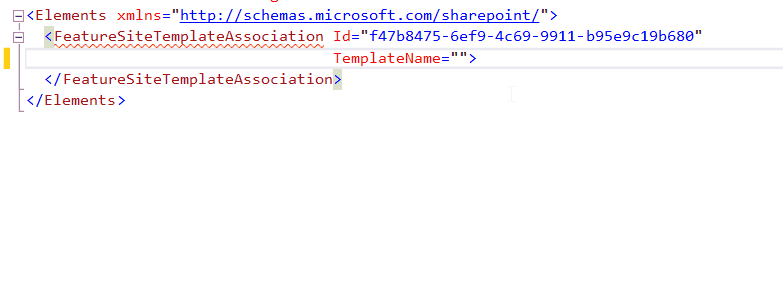

---
Title: FeatureSiteTemplateAssociation TemplateName attribute
FileName: FeatureSiteTemplateAssociationTemplateName.html
---

### Description
Feature stapling is an approach used to associate custom features with a site definition.  This feature will be activated automatically when a new site is created  from the associated site definition. The TemplateName attribute contains names of site definition configuration.
reSP allows you to select from the drop-down list.
Just use Ctrl+Space shortcut.
 

### Note
Feature stapling concept itself is fairly easy to use, but an important aspect in feature stapling is [the order](http://blogs.msdn.com/b/mcsnoiwb/archive/2008/05/28/site-provisioning-order.aspx) in which a site is provisioned:

1. global onet.xml
2. Site-scoped features defined in onet.xml, in the order they are defined in the file.
3. Site-scoped stapled features, activated asynchronously, on multiple threads
4. Web-scoped features defined in onet.xml, in the order they are defined in the file.
5. Web-scoped stapled features, activated asynchronously, on multiple threads
6. List instances defined in onet.xml
7. Modules defined in onet.xml

