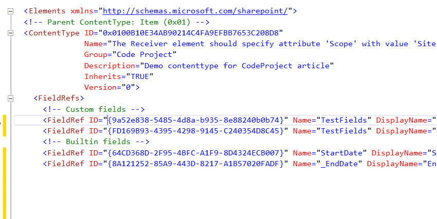

---
Title: FieldRef tag
FileName: FieldRef.html
---

### Description
Using FieldRefs tag the content type links fields. Each FieldRef should contain ID (Guid) of field.
Field names are displayed in the drop-down list if you press Ctrl+Space in any position of attribute value.
To build such list reSP grabs all solution fields and combines its with SharePoint builtins.
All caret preceded chars are used as filter in the dropdown list.
If the cursor is located in the fist position of attribute value then there is no filter and you will see all available choices.
You can type both Guid and field internal/display name. reSP validate it's correspondingly.
 

