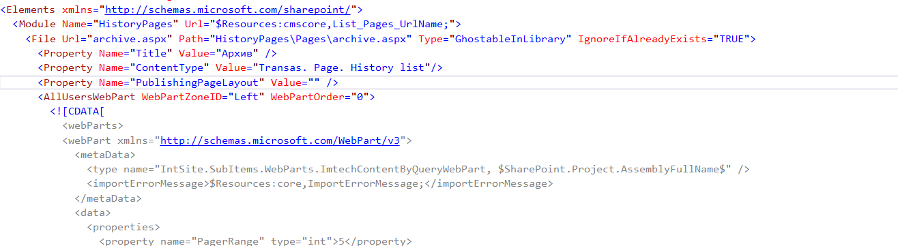

---
Title: PublishingPageLayout attribute
FileName: FilePublishingPageLayout.html
---

### Description
File definition (in module) has PublishingPageLayout attribute. It  tells SharePoint what page layout to associate with the listitem (page), it has a very specific format .
The PublishingPageLayout property format is:

{the url of the page layout}, {the title value of the page layout}

The gotcha is in the use of the comma (,); either don’t use it and just specify the url of the page layout, or, if you do use it make sure you leave a space character after the comma.

reSP allows you to select page layout file name from the drop-down list and constructs right attribute value.
Just use Ctrl+Space shortcut.
 

