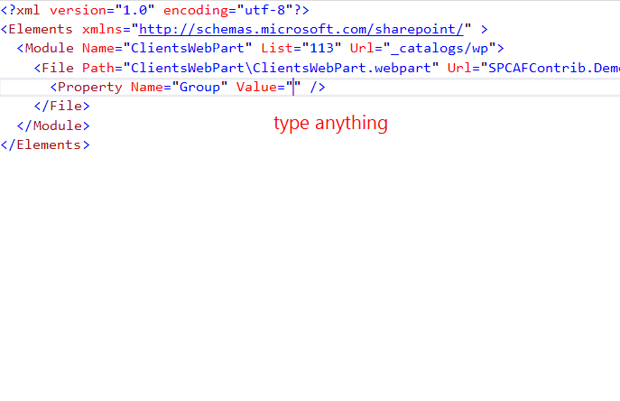

---
Title: Group in the web part manifest
FileName: WebPartGroup.html
---

### Description
Web part manifest defines group as file property. It should contain anything, but we recommend using already defined.
reSP allows you to change group name from the drop-down list.
Just use Ctrl+Space shortcut.
 

