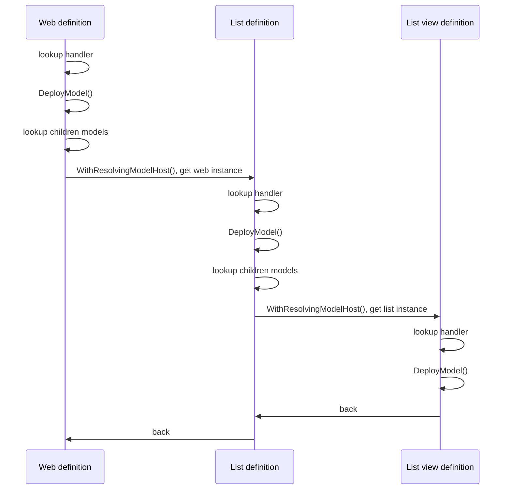

## Overview

SPMeta2 can be extended with custom definition and model handler, so that you can plug in your own provision logic.
This article provides basics on creating a custom definion and model handler for SPMeta2 library.

Before you begin, make sure you are familiar with the following concepts:

* [Get started with SPMeta2](/spmeta2/getting-started)
* [Definitions concept](/spmeta2/reference/definitions)
* [Models concept](/spmeta2/reference/models)
* [Provisioning services concept](/spmeta2/reference/provisionservices)


Here is a big puctire on how SPMeta2 provision walks through the web model with lists and list views.



At the end, SPMeta2 provision service walks through the model tree resolving correct model handler and calling a pair of DeployModel() and WithResolvingModelHost() methods.

All model handlers must inherit ModelHandlerBase class and implement the following methods:

* DeployModel(object modelHost, DefinitionBase model) method
* TargetType property
* Optionally, WithResolvingModelHost(ModelHostResolveContext context) method

DeployModel() methods must also raise a pair of OnProvisioning / OnProvisioned event, so that it would be possible to get access to the raw SharePoint object during the provision.

Let's have a closer look and create a simple custom definition with model handler.

## Scenario
We need to have a custom defintion to change existing web title and description.

## Creating definition
All definition should meet the following criterias:

* Inherit DefinitionBase class
* Have [Serializable] attribute

Here is how a custom ChangeWebTitleAndDescriptionDefinition might look like:

```cs
public class ChangeWebTitleAndDescriptionDefinition : DefinitionBase
{
    public string Title { get; set; }
    public string Description { get; set; }
}
```

### Creating model handlers
The next step would be creating a custom model handler:

```cs
public class ChangeWebTitleAndDescriptionModelHandler : CSOMModelHandlerBase
{
    public override Type TargetType
    {
        get { return typeof(ChangeWebTitleAndDescriptionDefinition); }
    }
 
    public override void DeployModel(object modelHost, DefinitionBase model)
    {
        var webModeHost = modelHost.WithAssertAndCast<WebModelHost>(
                                    "model",
                                    value => value.RequireNotNull());
 
        var definition = model.WithAssertAndCast<ChangeWebTitleAndDescriptionDefinition>(
                                    "model",
                                    value => value.RequireNotNull());
 
        var currentWeb = webModeHost.HostWeb;
        var context = currentWeb.Context;
 
        // raise OnProvisioning event
        InvokeOnModelEvent(this, new ModelEventArgs
        {
            CurrentModelNode = null,
            Model = null,
            EventType = ModelEventType.OnProvisioning,
            Object = currentWeb,
            ObjectType = typeof(Web),
            ObjectDefinition = definition,
            ModelHost = modelHost
        });
 
        // do stuff
        currentWeb.Title = definition.Title;
        currentWeb.Description = definition.Description;
 
        // raise OnProvisioned event
        InvokeOnModelEvent(this, new ModelEventArgs
        {
            CurrentModelNode = null,
            Model = null,
            EventType = ModelEventType.OnProvisioned,
            Object = currentWeb,
            ObjectType = typeof(Web),
            ObjectDefinition = definition,
            ModelHost = modelHost
        });
 
        currentWeb.Update();
        context.ExecuteQuery();
    }
}
```

### Registering model handler
One you created a custom model handler, we need to let SPMeta2 know about it.

Provision service have the following methods to address this:

* RegisterModelHandler(ModelHandlerBase modelHandlerType)
* RegisterModelHandlers(Assembly assembly)

Let's use the first one and register our handler:

```cs
var csomProvisionService = new CSOMProvisionService();
 
csomProvisionService.RegisterModelHandler(new ChangeWebTitleAndDescriptionModelHandler());
 
var webModel = SPMeta2Model.NewWebModel(web =>
{
    web.AddDefinitionNode(new ChangeWebTitleAndDescriptionDefinition
    {
        Title = "A new name for the web",
        Description = "Some changes done by ChangeWebTitleAndDescriptionDefinition"
    });
});
 
using (var clientContext = new ClientContext(CSOMSiteUrl))
    csomProvisionService.DeployWebModel(clientContext, webModel);
```

### Custom syntax
There is a separate article on how to create a [custom syntax extensions](/spmeta2/extensibility/custom-syntax/), so let's just improve our provision and add custom syntax for ChangeWebTitleAndDescriptionDefinition:

```cs
public static class ChangeWebTitleAndDescriptionDefinitionSyntax
{
    public static ModelNode AddChangeWebTitleAndDescription(this ModelNode model,
        ChangeWebTitleAndDescriptionDefinition definition)
    {
        return AddChangeWebTitleAndDescription(model, definition, null);
    }
 
    public static ModelNode AddChangeWebTitleAndDescription(this ModelNode model,
        ChangeWebTitleAndDescriptionDefinition definition, Action<ModelNode>
        action)
    {
        return model.AddDefinitionNode(definition, action);
    }
}
```

Now we can re-write provision with a better syntax:
```cs
var csomProvisionService = new CSOMProvisionService();
 
csomProvisionService.RegisterModelHandler(new ChangeWebTitleAndDescriptionModelHandler());
 
var webModel = SPMeta2Model.NewWebModel(web =>
{
    web.AddChangeWebTitleAndDescription(new ChangeWebTitleAndDescriptionDefinition
    {
        Title = "A new name for the web",
        Description = "Some changes done by ChangeWebTitleAndDescriptionDefinition"
    });
});
 
using (var clientContext = new ClientContext(CSOMSiteUrl))
    csomProvisionService.DeployWebModel(clientContext, webModel);
```

### Handling events
We expect that our model handler would raise OnProvisioning / OnProvisioned while pushing definition to SharePoint. Let's attache to these events and see how it goes.

```cs
var csomProvisionService = new CSOMProvisionService();
 
csomProvisionService.RegisterModelHandler(new ChangeWebTitleAndDescriptionModelHandler());
 
var webModel = SPMeta2Model.NewWebModel(web =>
{
    web.AddChangeWebTitleAndDescription(new ChangeWebTitleAndDescriptionDefinition
    {
        Title = "A new name for the web",
        Description = "Some changes done by ChangeWebTitleAndDescriptionDefinition"
    },
    changeWebAndTitle =>
    {
        changeWebAndTitle.OnProvisioning<Web, ChangeWebTitleAndDescriptionDefinition>(cntx =>
        {
            var cntxWeb = cntx.Object;
            var cntxDef = cntx.ObjectDefinition;
 
            // do stuff
        });
 
        changeWebAndTitle.OnProvisioned<Web, ChangeWebTitleAndDescriptionDefinition>(cntx =>
        {
            var cntxWeb = cntx.Object;
            var cntxDef = cntx.ObjectDefinition;
 
            // do stuff
        });
    });
});
 
using (var clientContext = new ClientContext(CSOMSiteUrl))
    csomProvisionService.DeployWebModel(clientContext, webModel);
```
