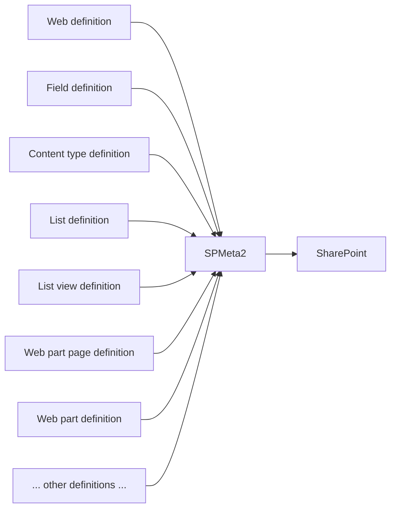
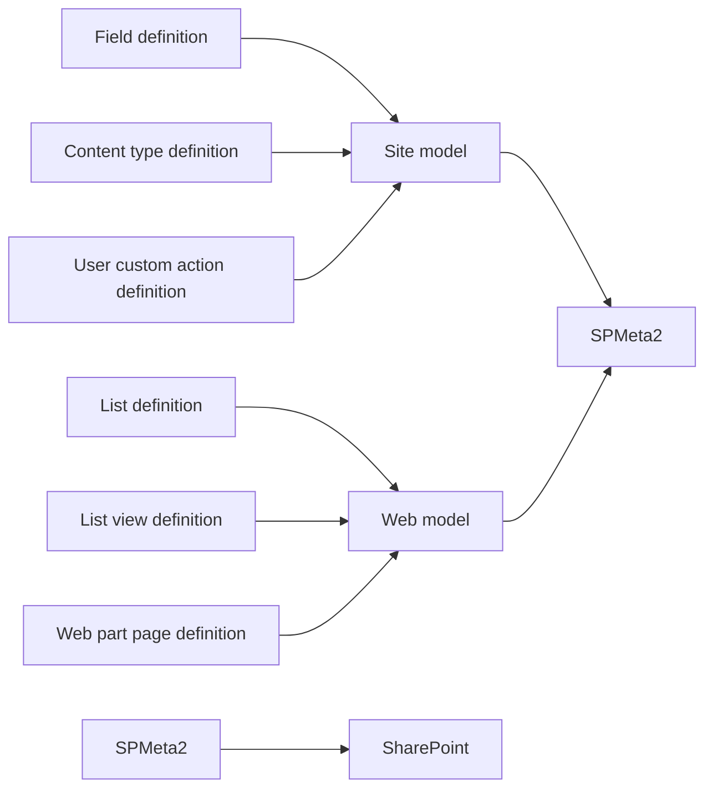
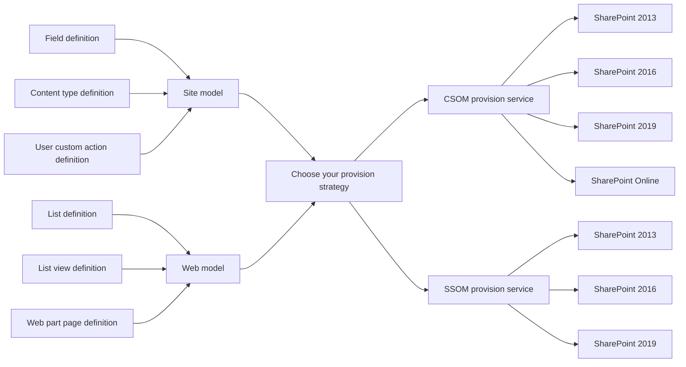

## SPMeta2 essentials

SPMeta2 is a hassle-free fluent API for code-based SharePoint artefact provisioning.
It offers a consistent provisioning API via SSOM/CSOM for SharePoin 2010, 2013 and O365.

The library provides an abstraction level over SharePoint API, so it is highly desired to understand a few concepts on which SPMeta2 library is built - definitions, models and provision services.

### A big picture
Here is a big pucture on how SPMeta2 library works.

SPMeta2 introduces a domain of c# POCO objects, then it maps every single POCO object on SharePoint artifacts.


Have a look on the same idea expressed in a c# code. 
Don not focus on understanding every single bit of the code, it will be much clear to you as we refine ideas later in the article.

```cs
// Step 1, create 'definitions' - a bunch of CSharp POCO objects 
var clientDescriptionField = new FieldDefinition
{
    Title = "Client Description",
    InternalName = "dcs_ClientDescription",
    Group = DocConsts.DefaulFieldsGroup,
    Id = new Guid("06975b67-01f5-47d7-9e2e-2702dfb8c217"),
    FieldType = BuiltInFieldTypes.Note,
};

var customerAccountContentType = new ContentTypeDefinition
{
    Name = "Customer Account",
    Id = new Guid("ddc46a66-19a0-460b-a723-c84d7f60a342"),
    ParentContentTypeId = BuiltInContentTypeId.Item,
    Group = DocConsts.DefaultContentTypeGroup
};

// step 2, define relationships between definitions
// we need to build a logical 'model tree'

// fields and content types live under site
// so use SiteModel and add fields/content types under site
var siteModel = SPMeta2Model.NewSiteModel(site =>
{
    site.AddField(clientDescriptionField);
    site.AddContentType(customerAccountContentType);
});

// step 3, deploy site model via CSOM
var csomProvisionService = new CSOMProvisionService();
csomProvisionService.DeploySiteModel(clientContext, siteModel);

```

### Zoom in, 1/3 scale - definitions

Let's zoom in and have a closer look.
SPMeta2 provides c# POCP objects, we call them **definitions** for every SharePoint artifact.
So you describe what you want to provision in definitions, and then SPMeta2 takes care about everything else.



And the same idea in the code. Now field definition and content type definition make sense, don't they?
Don't focus on understanding every single bit of the code, it will be much clear to you as we refine ideas later in the article.

```cs
// Step 1, create 'definitions' - a bunch of CSharp POCO objects 
var clientDescriptionField = new FieldDefinition
{
    Title = "Client Description",
    InternalName = "dcs_ClientDescription",
    Group = DocConsts.DefaulFieldsGroup,
    Id = new Guid("06975b67-01f5-47d7-9e2e-2702dfb8c217"),
    FieldType = BuiltInFieldTypes.Note,
};

var customerAccountContentType = new ContentTypeDefinition
{
    Name = "Customer Account",
    Id = new Guid("ddc46a66-19a0-460b-a723-c84d7f60a342"),
    ParentContentTypeId = BuiltInContentTypeId.Item,
    Group = DocConsts.DefaultContentTypeGroup
};

// step 2, define relationships between definitions
// we need to build a logical 'model tree'

// fields and content types live under site
// so use SiteModel and add fields/content types under site
var siteModel = SPMeta2Model.NewSiteModel(site =>
{
    site.AddField(clientDescriptionField);
    site.AddContentType(customerAccountContentType);
});

// step 3, deploy site model via CSOM
var csomProvisionService = new CSOMProvisionService();
csomProvisionService.DeploySiteModel(clientContext, siteModel);

```

### Zoom in, 2/3 scale - models

All SharePoint artifacts have relationships between each other.
For intance, here a few to mentions:

* fields belong to site, web or list
* content types belong to site or web
* lists belong to web
* list views belong to list
* etc..

Having definitions of not enought, we need to describe relationshop between them, so that SPMeta2 would know how to provision them correctly. 
Here is a refined view on how SPMeta2 works for site and web level provision:



And the same idea in the code. NewSiteModel(), AddField() and AddContentType() help to build a relationships between artifacts
Don't focus on understanding every single bit of the code, it will be much clear to you as we refine ideas later in the article.

```cs
// Step 1, create 'definitions' - a bunch of CSharp POCO objects 
var clientDescriptionField = new FieldDefinition
{
    Title = "Client Description",
    InternalName = "dcs_ClientDescription",
    Group = DocConsts.DefaulFieldsGroup,
    Id = new Guid("06975b67-01f5-47d7-9e2e-2702dfb8c217"),
    FieldType = BuiltInFieldTypes.Note,
};

var customerAccountContentType = new ContentTypeDefinition
{
    Name = "Customer Account",
    Id = new Guid("ddc46a66-19a0-460b-a723-c84d7f60a342"),
    ParentContentTypeId = BuiltInContentTypeId.Item,
    Group = DocConsts.DefaultContentTypeGroup
};

// step 2, define relationships between definitions
// we need to build a logical 'model tree'

// fields and content types live under site
// so use SiteModel and add fields/content types under site
var siteModel = SPMeta2Model.NewSiteModel(site =>
{
    site.AddField(clientDescriptionField);
    site.AddContentType(customerAccountContentType);
});

// step 3, deploy site model via CSOM
var csomProvisionService = new CSOMProvisionService();
csomProvisionService.DeploySiteModel(clientContext, siteModel);

```

### Zoom in, 3/3 scale - provision services

We can have SharePoint 2010, SharePoint 2013 or SharePoint Online along with either SSOM or CSOM API.
SPMeta2 supports both SSOM and CSOM API abstracting them via 'provisioning services' implementations.

Here is an idea for SSOM or CSOM based provision:



Finally, the code should be absolutely clear to you. We create definitions, we build a logical model and then we use a provision service to push the model to the SharePoint site. Easy enough?

```cs
// Step 1, create 'definitions' - a bunch of CSharp POCO objects 
var clientDescriptionField = new FieldDefinition
{
    Title = "Client Description",
    InternalName = "dcs_ClientDescription",
    Group = DocConsts.DefaulFieldsGroup,
    Id = new Guid("06975b67-01f5-47d7-9e2e-2702dfb8c217"),
    FieldType = BuiltInFieldTypes.Note,
};

var customerAccountContentType = new ContentTypeDefinition
{
    Name = "Customer Account",
    Id = new Guid("ddc46a66-19a0-460b-a723-c84d7f60a342"),
    ParentContentTypeId = BuiltInContentTypeId.Item,
    Group = DocConsts.DefaultContentTypeGroup
};

// step 2, define relationships between definitions
// we need to build a logical 'model tree'

// fields and content types live under site
// so use SiteModel and add fields/content types under site
var siteModel = SPMeta2Model.NewSiteModel(site =>
{
    site.AddField(clientDescriptionField);
    site.AddContentType(customerAccountContentType);
});

// step 3, deploy site model via CSOM
var csomProvisionService = new CSOMProvisionService();
csomProvisionService.DeploySiteModel(clientContext, siteModel);

```