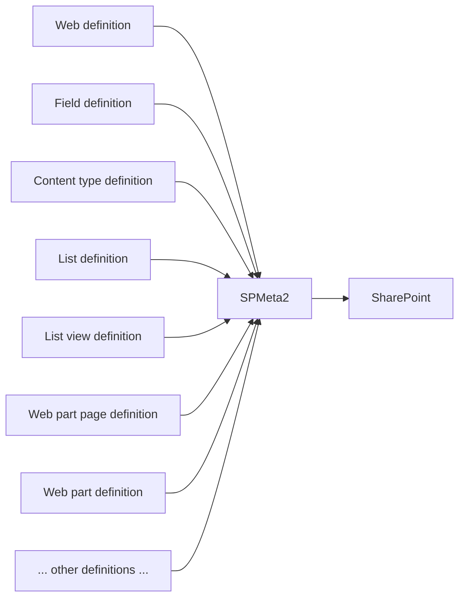
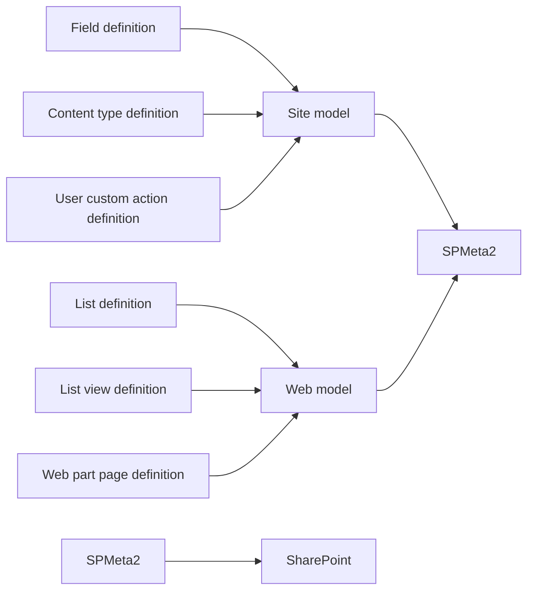

## SPMeta2 Models

SPMeta2 introduces a domain model providing set of definitions for most of the SharePoint artifacts.

Before you begin, make sure you are familiar with the following concepts:

* [Get started with SPMeta2](/spmeta2/getting-started)
* [Definitions concept](/spmeta2/reference/definitions)

### Domain model

SPMeta2 introduces a domain of c# POCO objects, then it maps every single POCO object on SharePoint artifacts.



Once artifacts are defined, a **model** is used to group artifacts together and to indicate an entry point for the provision flow.
SPMeta2 has several types of models, but the most used are the following:

* Site model
* Web model

Here is a refined view on definitions grouping under the site and web models:



### Creating a new model
Depending on your scenarios, you might be interested to create either site or web model, setup definitions and then run the provision.
SPMeta2 has a helper class **SPMeta2Model** which provides the following methods:

* SPMeta2Model.NewFarmModel(..)
* SPMeta2Model.NewWebApplicationModel(..)
* SPMeta2Model.NewSiteModel(..)
* SPMeta2Model.NewWebModel(..)

Most of the time you would be using either NewSiteModel() or NewWebModel() methods to get a new model instance.
Here are a few patterns on how to setup initial provision flow:

#### Setting up a site model

```cs
// step 1, setup your definition
 
// step 2, setup your site models
var taxonomyModel = SPMeta2Model.NewSiteModel(site =>
{
    // setup site taxonomy
});
 
var featuresAndSandboxSolutionsModel = SPMeta2Model.NewSiteModel(site =>
{
    // setup sandbox solutions and features
});
 
var fieldsAndContentTypesModel = SPMeta2Model.NewSiteModel(site =>
{
    // setup fields and content types
});
 
// step 3, deploy site models
```

#### Setting up a web model
```cs
// step 1, setup your definition
 
// step 2, setup your site models
var featuresModel = SPMeta2Model.NewWebModel(web =>
{
    // setup features
});
 
var listsModel = SPMeta2Model.NewWebModel(web =>
{
    // setup fields and content types
});
 
var navigationModel = SPMeta2Model.NewWebModel(web =>
{
    // setup web navigation
});
 
// step 3, deploy web models
```